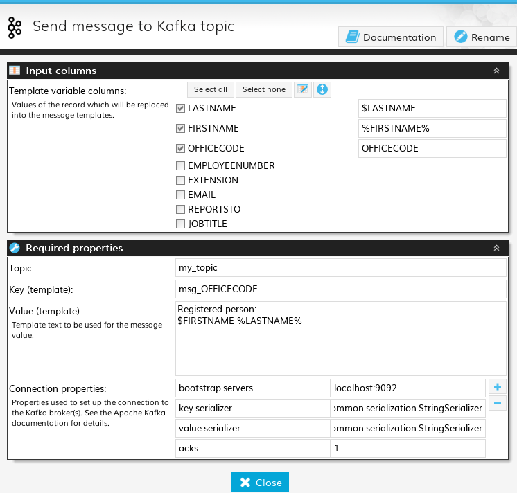

# extension_kafka
A DataCleaner extension for sending messages through Apache Kafka.

Configured a la this:

 

Messages are built using plain search/replace templates. Notice how the three columns in the top of the screenshot are referred to in the message key and value below.

The extension assumes that the message payload will be String based. Custom serializers can be used, as long as they work on strings.
